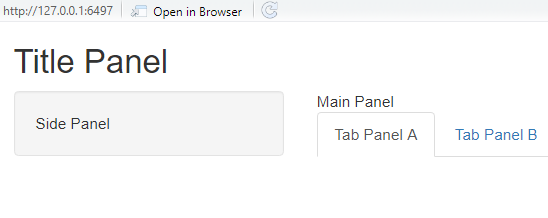
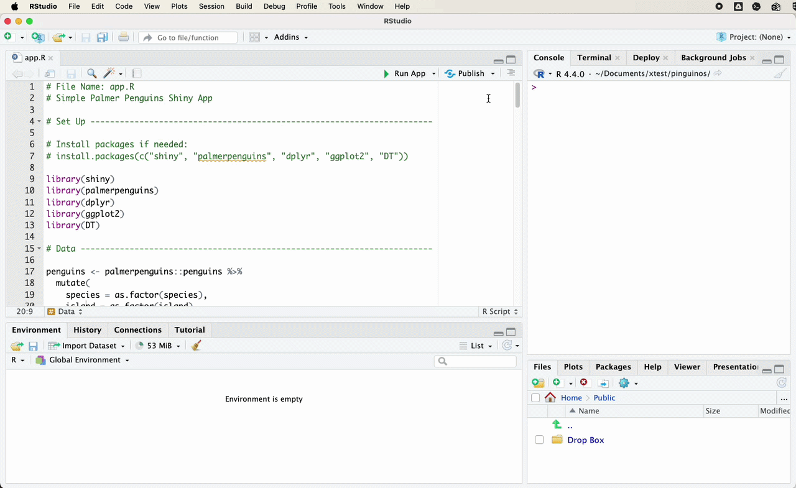

# Dashboards with `Shiny` {#dashboards}

A dashboard is useful when a research project produces material that is easier to explore than to summarize in a single figure or table. Many research projects generate indicators, case classifications, qualitative metadata, country profiles, interview summaries, maps, model outputs, or coded documents. Some of these can be placed in a paper. Some can be placed in an appendix. But when the reader needs to filter, compare, inspect, and move between levels of detail, a static document becomes limited.

`Shiny` lets us build interactive web applications directly from R. We can use the same language we already use for cleaning data, estimating models, and producing plots to create a small web interface around research data.

This chapter introduces the basic logic of `Shiny` by building a small dashboard with the `palmerpenguins` data set. The example is simple, but the structure is the same one used in larger research dashboards. The user selects filters in the interface. The server uses those filters to subset the data. The app then updates a summary, a plot, and a table.

The goal is not to build a perfect dashboard. The goal is to understand the minimum structure of a working app and to see how that structure can support research communication.

## What is a dashboard?

A dashboard is an interface for exploring data.

A static plot answers a question chosen by the researcher. A dashboard lets the user ask a small number of related questions by changing inputs. For example, a dashboard can let users select a country, choose a time period, compare regions, inspect a table, or move between different indicators.

For research communication, the audience often wants to see more than the final argument. They may want to know which cases are included, how indicators change across time, whether a finding is driven by a subset of observations, or how a specific country compares with others.

Dashboards are especially useful when a project has several layers of information. A paper can explain the argument. A dashboard can make part of the evidence base easier to inspect.

This is also the logic behind research dashboards such as FIRSA. A dashboard is not a replacement for the research project. It is a way of making selected parts of the project visible, navigable, and reusable.

## What is R Shiny?

A `Shiny` app is a web application connected to an R session.

The user sees a web page. Behind that page, R is running code. When the user changes something in the interface, the R code reacts and sends an updated output back to the page.

A basic `Shiny` app has three parts.

First, the user interface, usually called the `ui`, defines what the user sees. This includes the title, text, inputs, plots, tables, and layout.

Second, the server defines what R does. This is where we filter data, create plots, calculate summaries, and prepare tables.

Third, `shinyApp()` combines the `ui` and the `server` into a working app.

```{r}
#| echo: true
#| eval: false

library(shiny)

ui <- fluidPage()

server <- function(input, output) {}

shinyApp(ui = ui, server = server)
```

This is the smallest possible template for a `Shiny` app. It does not show anything useful yet, but it already contains the structure we need.

## How Shiny reacts

The easiest way to understand `Shiny` is to think of it as a small loop between the browser and R.

The user changes something in the interface. `Shiny` stores that choice inside the `input` object. The server reads the relevant value from `input`, reruns the code that depends on it, and sends the updated result back to the matching output in the interface.

A simple workflow looks like this.

```{r}
#| echo: true
#| eval: false

# user selects a species in the UI
input$species

# server uses that value
filtered_penguins()

# server creates outputs
output$summary_text
output$penguin_plot
output$penguin_table
```

Names are very important in `Shiny`. An input created in the UI with `inputId = "species"` is read in the server as `input$species`. An output placed in the UI with `plotOutput("penguin_plot")` is created in the server as `output$penguin_plot`.

The app works when the names in the interface and the names in the server match. Many beginner errors in `Shiny` come from small mismatches between these names.

A useful way to remember the structure is to move from input, to reactive code, to output.

```{r}
#| echo: true
#| eval: false

input$something

reactive_code()

output$something
```

In the penguins app, the species and island inputs feed into a filtered data set. That filtered data set is then reused by the summary, the plot, and the table.

## Installing the packages

For this chapter, we use five packages.

```{r}
#| echo: true
#| eval: false

install.packages(c(
  "shiny",
  "palmerpenguins",
  "dplyr",
  "ggplot2",
  "DT"
))
```

Then we load them.

```{r}
#| echo: true
#| eval: false

library(shiny)
library(palmerpenguins)
library(dplyr)
library(ggplot2)
library(DT)
```

The `shiny` package creates the app. The `palmerpenguins` package gives us a clean demonstration data set. The `dplyr` package helps us filter and transform the data. The `ggplot2` package creates the plot. The `DT` package creates an interactive table.

## The app file

A simple `Shiny` app can be written in a single file called `app.R`.

The file should usually have this structure.

```{r}
#| echo: true
#| eval: false

# Packages

# Data

# User interface

# Server

# Run app
```

This may look too simple, but it is a useful habit. As an app grows, it becomes easier to lose track of where things are happening. Keeping the file organized helps you debug the app later.

For the rest of the chapter, we will build the app one section at a time.

Posit has a short article on [app formats and launching apps](https://shiny.posit.co/r/articles/build/app-formats/) that explains the difference between a single `app.R` file and the older two file structure with `ui.R` and `server.R`.

## App folders and file organization

A single `app.R` file is enough for the example in this chapter. It keeps the full structure visible.

Research dashboards often need more organization. They may include cleaned data, helper functions, images, CSS files, downloadable outputs, or documentation. A project folder might look like this.

```text
my_app/
├── app.R
├── data/
│   └── penguins.csv
├── R/
│   └── helpers.R
├── figures/
│   └── scatterplot.png
├── www/
│   ├── styles.css
│   └── logo.png
└── outputs/
    └── filtered_data.csv
```

The `data` folder can store input data. The `R` folder can store helper functions. The `www` folder is used for files that the web app needs to serve directly, such as images, icons, or CSS. The `outputs` folder can store files created by the app or files that users can download.

A useful habit is to start with one file, then move repeated code into helper functions once the app becomes difficult to read. The aim is not to create a complicated structure from the beginning. The aim is to keep the app understandable as it grows.

## Preparing the data

We start by loading the penguins data and converting two variables into factors.

```{r}
#| echo: true
#| eval: false

penguins <- palmerpenguins::penguins |>
  mutate(
    species = as.factor(species),
    island = as.factor(island)
  )
```

The data set contains observations on penguins from three species and three islands. For this tutorial, we will use the app to filter the data by species and island, then display a summary, a scatterplot, and a table.

We can quickly inspect the variables.

```{r}
#| echo: true
#| eval: false

glimpse(penguins)
```

The important variables for the dashboard are `species`, `island`, `flipper_length_mm`, and `body_mass_g`.

## Building the user interface

The user interface is created with `fluidPage()`.

The simplest version of the interface can include only a title.

```{r}
#| echo: true
#| eval: false

ui <- fluidPage(
  titlePanel("Palmer Penguins Shiny Demo")
)
```

This creates a web page with a title. Nothing else happens yet because we have not added inputs or outputs.

A more useful layout separates the page into a sidebar and a main panel. The sidebar usually contains the controls. The main panel usually contains the results.

```{r}
#| echo: true
#| eval: false

ui <- fluidPage(
  titlePanel("Palmer Penguins Shiny Demo"),

  sidebarLayout(
    sidebarPanel(
      "Inputs will go here"
    ),

    mainPanel(
      "Outputs will go here"
    )
  )
)
```

This layout is common because it matches the basic logic of a dashboard. The user changes something on the left. The result appears on the right.

<!-- Placeholder image. Add figures/shinylayout.png to the figures folder if it is missing. -->


The same structure can be represented with code.

```{r}
#| echo: true
#| eval: false

ui <- fluidPage(
  titlePanel("Title Panel"),

  sidebarLayout(
    sidebarPanel(
      "Side Panel"
    ),

    mainPanel(
      "Main Panel",

      tabsetPanel(
        tabPanel("Tab Panel A"),
        tabPanel("Tab Panel B")
      )
    )
  )
)
```

In this chapter we will use a simple sidebar layout without tabs. For a larger research dashboard, tabs are useful when the app contains different sections, such as an overview page, a country profile page, a methods page, and a data table.

<!-- Placeholder image. Add figures/example_layout.png to the figures folder if it is missing. -->



## Adding inputs

Inputs collect information from the user.

In this app, we want users to choose a species, choose an island, and decide whether to show a trend line in the plot.

The first input is a menu created with `selectInput()`.

```{r}
#| echo: true
#| eval: false

selectInput(
  inputId = "species",
  label = "Choose species",
  choices = c("All", levels(penguins$species)),
  selected = "All"
)
```

The `inputId` is important. It is the name that the server will use to read the user selection. If the user chooses `"Adelie"`, then the server can access that value through `input$species`.

The `label` is the text shown to the user.

The `choices` are the options available in the menu.

The `selected` value is the default option.

We use the same structure for island.

```{r}
#| echo: true
#| eval: false

selectInput(
  inputId = "island",
  label = "Choose island",
  choices = c("All", levels(penguins$island)),
  selected = "All"
)
```

Finally, we add a checkbox for the trend line.

```{r}
#| echo: true
#| eval: false

checkboxInput(
  inputId = "show_smooth",
  label = "Show trend line",
  value = TRUE
)
```

A checkbox returns either `TRUE` or `FALSE`. In the server, we will use this value to decide whether to add `geom_smooth()` to the plot.

Now we can place all three inputs inside the sidebar.

```{r}
#| echo: true
#| eval: false

ui <- fluidPage(
  titlePanel("Palmer Penguins Shiny Demo"),

  sidebarLayout(
    sidebarPanel(
      selectInput(
        inputId = "species",
        label = "Choose species",
        choices = c("All", levels(penguins$species)),
        selected = "All"
      ),

      selectInput(
        inputId = "island",
        label = "Choose island",
        choices = c("All", levels(penguins$island)),
        selected = "All"
      ),

      checkboxInput(
        inputId = "show_smooth",
        label = "Show trend line",
        value = TRUE
      )
    ),

    mainPanel(
      "Outputs will go here"
    )
  )
)
```

At this point, the app has controls, but they do not affect anything yet. Inputs only become useful when the server uses them.

## Adding outputs

Outputs define what appears in the app.

For this example, we want three outputs.

We want a printed summary.

```{r}
#| echo: true
#| eval: false

verbatimTextOutput("summary_text")
```

We want a plot.

```{r}
#| echo: true
#| eval: false

plotOutput("penguin_plot", height = "450px")
```

And we want an interactive table.

```{r}
#| echo: true
#| eval: false

DTOutput("penguin_table")
```

The names inside these functions are output IDs. They must match objects created in the server.

For example, if the UI contains this output,

```{r}
#| echo: true
#| eval: false

plotOutput("penguin_plot")
```

then the server must create this object.

```{r}
#| echo: true
#| eval: false

output$penguin_plot <- renderPlot({
  # plot code goes here
})
```

This is one of the most important rules in `Shiny`.

The UI places an output on the page. The server creates the content for that output. The names must match.

Now we can add the outputs to the main panel.

```{r}
#| echo: true
#| eval: false

ui <- fluidPage(
  titlePanel("Palmer Penguins Shiny Demo"),

  sidebarLayout(
    sidebarPanel(
      selectInput(
        inputId = "species",
        label = "Choose species",
        choices = c("All", levels(penguins$species)),
        selected = "All"
      ),

      selectInput(
        inputId = "island",
        label = "Choose island",
        choices = c("All", levels(penguins$island)),
        selected = "All"
      ),

      checkboxInput(
        inputId = "show_smooth",
        label = "Show trend line",
        value = TRUE
      )
    ),

    mainPanel(
      h3("Summary"),
      verbatimTextOutput("summary_text"),

      h3("Scatterplot"),
      plotOutput("penguin_plot", height = "450px"),

      h3("Data"),
      DTOutput("penguin_table")
    )
  )
)
```

The user interface is now ready. It tells the app what the user sees, but it still does not tell R how to produce the outputs.

That happens in the server.

## Building the server

The server is where the app does the work.

Every server function has this structure.

```{r}
#| echo: true
#| eval: false

server <- function(input, output) {

}
```

The `input` object contains values selected by the user. The `output` object contains the results sent back to the interface.

For example, if the UI contains an input called `"species"`, then the server can read the selected species with `input$species`.

If the UI contains an output called `"summary_text"`, then the server can create it with `output$summary_text`.

The server code for a printed summary looks like this.

```{r}
#| echo: true
#| eval: false

server <- function(input, output) {

  output$summary_text <- renderPrint({
    data <- penguins

    if (input$species != "All") {
      data <- data |>
        filter(species == input$species)
    }

    if (input$island != "All") {
      data <- data |>
        filter(island == input$island)
    }

    cat("Rows:", nrow(data), "\n")
    cat("Species:", paste(unique(data$species), collapse = ", "), "\n")
    cat("Islands:", paste(unique(data$island), collapse = ", "), "\n")
    cat(
      "Average body mass:",
      round(mean(data$body_mass_g, na.rm = TRUE), 1),
      "g\n"
    )
  })
}
```

This code creates an output called `summary_text`.

The UI displays that output with `verbatimTextOutput("summary_text")`.

Inside `renderPrint()`, we first copy the full penguins data into an object called `data`. Then we filter it depending on the user selections. If the selected species is not `"All"`, we keep only the selected species. If the selected island is not `"All"`, we keep only the selected island.

Finally, we print a few summary lines using `cat()`.

This is reactive because the code depends on `input$species` and `input$island`. When either input changes, Shiny reruns the code inside `renderPrint()` and updates the summary.

## Adding the plot

The plot works in the same way.

The UI contains this output.

```{r}
#| echo: true
#| eval: false

plotOutput("penguin_plot", height = "450px")
```

The server creates it with `renderPlot()`.

```{r}
#| echo: true
#| eval: false

output$penguin_plot <- renderPlot({
  data <- penguins

  if (input$species != "All") {
    data <- data |>
      filter(species == input$species)
  }

  if (input$island != "All") {
    data <- data |>
      filter(island == input$island)
  }

  data <- data |>
    filter(
      !is.na(flipper_length_mm),
      !is.na(body_mass_g)
    )

  p <- ggplot(
    data,
    aes(
      x = flipper_length_mm,
      y = body_mass_g,
      colour = species
    )
  ) +
    geom_point(size = 3, alpha = 0.8) +
    labs(
      x = "Flipper length, mm",
      y = "Body mass, g",
      colour = "Species",
      title = "Body mass and flipper length"
    ) +
    theme_minimal(base_size = 14)

  if (input$show_smooth) {
    p <- p + geom_smooth(method = "lm", se = FALSE)
  }

  p
})
```

The first part of the code filters the data. The second part creates the plot. The final `if` statement checks whether the user selected the trend line option. If `input$show_smooth` is `TRUE`, the app adds a linear trend line.

This is a basic example of conditional display. The plot changes depending on what the user asks to see.

In a research dashboard, the same logic might control whether to display confidence intervals, labels, countries in a region, model specifications, or alternative indicators.

## Adding the table

The table output is created with `DT`.

The UI contains this output.

```{r}
#| echo: true
#| eval: false

DTOutput("penguin_table")
```

The server creates it with `renderDT()`.

```{r}
#| echo: true
#| eval: false

output$penguin_table <- renderDT({
  data <- penguins

  if (input$species != "All") {
    data <- data |>
      filter(species == input$species)
  }

  if (input$island != "All") {
    data <- data |>
      filter(island == input$island)
  }

  datatable(
    data,
    options = list(pageLength = 8),
    rownames = FALSE
  )
})
```

This gives the user an interactive table with search and pagination. For research dashboards, tables are often just as important as plots. They let users inspect the actual observations behind a visualization.

This is especially useful when the dashboard presents case classifications, coding decisions, country indicators, or project metadata.

## Avoiding repeated filtering

The current app repeats the same filtering code three times. The summary, plot, and table all begin by creating a filtered version of the data.

This works, but it is not ideal.

A cleaner approach is to create one reactive object that stores the filtered data. Then each output can reuse that same object.

In Shiny, this is done with `reactive()`.

```{r}
#| echo: true
#| eval: false

filtered_penguins <- reactive({
  data <- penguins

  if (input$species != "All") {
    data <- data |>
      filter(species == input$species)
  }

  if (input$island != "All") {
    data <- data |>
      filter(island == input$island)
  }

  data
})
```

A reactive object is like a small function. To use it, we call it with parentheses.

```{r}
#| echo: true
#| eval: false

data <- filtered_penguins()
```

This lets us simplify the server.

```{r}
#| echo: true
#| eval: false

server <- function(input, output) {

  filtered_penguins <- reactive({
    data <- penguins

    if (input$species != "All") {
      data <- data |>
        filter(species == input$species)
    }

    if (input$island != "All") {
      data <- data |>
        filter(island == input$island)
    }

    data
  })

  output$summary_text <- renderPrint({
    data <- filtered_penguins()

    cat("Rows:", nrow(data), "\n")
    cat("Species:", paste(unique(data$species), collapse = ", "), "\n")
    cat("Islands:", paste(unique(data$island), collapse = ", "), "\n")
    cat(
      "Average body mass:",
      round(mean(data$body_mass_g, na.rm = TRUE), 1),
      "g\n"
    )
  })

  output$penguin_plot <- renderPlot({
    data <- filtered_penguins() |>
      filter(
        !is.na(flipper_length_mm),
        !is.na(body_mass_g)
      )

    p <- ggplot(
      data,
      aes(
        x = flipper_length_mm,
        y = body_mass_g,
        colour = species
      )
    ) +
      geom_point(size = 3, alpha = 0.8) +
      labs(
        x = "Flipper length, mm",
        y = "Body mass, g",
        colour = "Species",
        title = "Body mass and flipper length"
      ) +
      theme_minimal(base_size = 14)

    if (input$show_smooth) {
      p <- p + geom_smooth(method = "lm", se = FALSE)
    }

    p
  })

  output$penguin_table <- renderDT({
    datatable(
      filtered_penguins(),
      options = list(pageLength = 8),
      rownames = FALSE
    )
  })
}
```

This is closer to how a real dashboard should be written. If we later change the filtering logic, we only need to change it once.

Posit's [lesson on reactive expressions](https://shiny.posit.co/r/getstarted/shiny-basics/lesson6/) gives a useful explanation of how reactive objects help control which parts of an app update.

## The complete basic app

Here is the complete version of the basic app.

Save this file as `app.R`.

```{r}
#| echo: true
#| eval: false

# File name
# app.R

# Packages

library(shiny)
library(palmerpenguins)
library(dplyr)
library(ggplot2)
library(DT)

# Data

penguins <- palmerpenguins::penguins |>
  mutate(
    species = as.factor(species),
    island = as.factor(island)
  )

# User interface

ui <- fluidPage(
  titlePanel("Palmer Penguins Shiny Demo"),

  sidebarLayout(
    sidebarPanel(
      selectInput(
        inputId = "species",
        label = "Choose species",
        choices = c("All", levels(penguins$species)),
        selected = "All"
      ),

      selectInput(
        inputId = "island",
        label = "Choose island",
        choices = c("All", levels(penguins$island)),
        selected = "All"
      ),

      checkboxInput(
        inputId = "show_smooth",
        label = "Show trend line",
        value = TRUE
      )
    ),

    mainPanel(
      h3("Summary"),
      verbatimTextOutput("summary_text"),

      h3("Scatterplot"),
      plotOutput("penguin_plot", height = "450px"),

      h3("Data"),
      DTOutput("penguin_table")
    )
  )
)

# Server

server <- function(input, output) {

  filtered_penguins <- reactive({
    data <- penguins

    if (input$species != "All") {
      data <- data |>
        filter(species == input$species)
    }

    if (input$island != "All") {
      data <- data |>
        filter(island == input$island)
    }

    data
  })

  output$summary_text <- renderPrint({
    data <- filtered_penguins()

    cat("Rows:", nrow(data), "\n")
    cat("Species:", paste(unique(data$species), collapse = ", "), "\n")
    cat("Islands:", paste(unique(data$island), collapse = ", "), "\n")
    cat(
      "Average body mass:",
      round(mean(data$body_mass_g, na.rm = TRUE), 1),
      "g\n"
    )
  })

  output$penguin_plot <- renderPlot({
    data <- filtered_penguins() |>
      filter(
        !is.na(flipper_length_mm),
        !is.na(body_mass_g)
      )

    p <- ggplot(
      data,
      aes(
        x = flipper_length_mm,
        y = body_mass_g,
        colour = species
      )
    ) +
      geom_point(size = 3, alpha = 0.8) +
      labs(
        x = "Flipper length, mm",
        y = "Body mass, g",
        colour = "Species",
        title = "Body mass and flipper length"
      ) +
      theme_minimal(base_size = 14)

    if (input$show_smooth) {
      p <- p + geom_smooth(method = "lm", se = FALSE)
    }

    p
  })

  output$penguin_table <- renderDT({
    datatable(
      filtered_penguins(),
      options = list(pageLength = 8),
      rownames = FALSE
    )
  })
}

# Run app

shinyApp(ui = ui, server = server)
```

To run the app, open `app.R` in RStudio and click **Run App**.

You can also run the app from the console.

```{r}
#| echo: true
#| eval: false

shiny::runApp()
```

The app should open in a browser window or in the RStudio viewer.

<iframe
  src="https://alfredohs.shinyapps.io/pinguinos/"
  width="100%"
  height="650"
  style="border: 1px solid #ddd; border-radius: 8px;"
  allowfullscreen>
</iframe>

## A more developed version of the same app

The basic app is enough to understand the core structure of `Shiny`. It has inputs, outputs, a server, and a reactive object. It also shows how a simple research dashboard can connect filters, plots, summaries, and tables.

A more developed version of the same app can add design and control without changing the underlying logic too much.

The advanced version below uses a more dashboard oriented layout. It adds summary value boxes, a wider set of filters, an update button, validation for empty selections, and a download button. It also separates instant input changes from app updates. The user can change several inputs first, then click the button once.

That pattern is useful for research dashboards that run slow models, query larger files, or pull data from external sources. In those cases, recalculating after every small input change can make the app feel unstable.

<iframe
  src="https://penguins.alfredohs.com"
  width="100%"
  height="720"
  style="border: 1px solid #ddd; border-radius: 8px;"
  allowfullscreen>
</iframe>

The main conceptual difference is the use of `eventReactive()`. The basic app uses `reactive()`, so the filtered data update whenever an input changes. The advanced app uses an update button, so the filtered data update only when the user asks for the dashboard to refresh.

The advanced version also uses `validate()` and `need()` to give readable messages when a selection does not return data. In research dashboards, empty results are not always errors. A country may have no observations for a year. A policy may not exist in a selected region. A document may not contain a coded category. The app should handle those cases clearly.

The code below is longer than the basic app, but the architecture is the same. There is still a user interface. There is still a server. There is still a filtered data object. The extra code mostly improves layout, user control, and reliability.

```{r}
#| echo: true
#| eval: false
#| code-fold: true
#| code-summary: "Show the complete advanced app code"

# File name
# app.R

# Packages

library(shiny)
library(bslib)
library(palmerpenguins)
library(dplyr)
library(ggplot2)
library(DT)

# Data

penguins <- palmerpenguins::penguins |>
  mutate(
    species = as.factor(species),
    island = as.factor(island)
  )

mass_min <- floor(min(penguins$body_mass_g, na.rm = TRUE))
mass_max <- ceiling(max(penguins$body_mass_g, na.rm = TRUE))

# User interface

ui <- page_sidebar(
  title = "Palmer Penguins Research Dashboard",

  sidebar = sidebar(
    selectInput(
      inputId = "species",
      label = "Choose species",
      choices = c("All", levels(penguins$species)),
      selected = "All"
    ),

    checkboxGroupInput(
      inputId = "islands",
      label = "Choose islands",
      choices = levels(penguins$island),
      selected = levels(penguins$island)
    ),

    sliderInput(
      inputId = "body_mass_range",
      label = "Body mass range, grams",
      min = mass_min,
      max = mass_max,
      value = c(mass_min, mass_max),
      step = 100
    ),

    checkboxInput(
      inputId = "show_smooth",
      label = "Show trend line",
      value = TRUE
    ),

    actionButton(
      inputId = "update",
      label = "Update dashboard"
    ),

    downloadButton(
      outputId = "download_data",
      label = "Download filtered data"
    ),

    helpText(
      "Change the filters, then update the dashboard."
    )
  ),

  layout_columns(
    value_box(
      title = "Rows",
      value = textOutput("n_rows", inline = TRUE)
    ),

    value_box(
      title = "Average body mass",
      value = textOutput("mean_mass", inline = TRUE)
    ),

    value_box(
      title = "Species shown",
      value = textOutput("species_count", inline = TRUE)
    )
  ),

  card(
    card_header("Body mass and flipper length"),
    plotOutput("penguin_plot", height = "480px")
  ),

  card(
    card_header("Filtered data"),
    DTOutput("penguin_table")
  )
)

# Server

server <- function(input, output, session) {

  filtered_penguins <- eventReactive(
    input$update,
    {
      validate(
        need(
          length(input$islands) > 0,
          "Choose at least one island."
        )
      )

      data <- penguins |>
        filter(
          !is.na(flipper_length_mm),
          !is.na(body_mass_g),
          island %in% input$islands,
          body_mass_g >= input$body_mass_range[1],
          body_mass_g <= input$body_mass_range[2]
        )

      if (input$species != "All") {
        data <- data |>
          filter(species == input$species)
      }

      validate(
        need(
          nrow(data) > 0,
          "No penguins match the selected filters."
        )
      )

      data
    },
    ignoreNULL = FALSE
  )

  output$n_rows <- renderText({
    data <- filtered_penguins()
    format(nrow(data), big.mark = ",")
  })

  output$mean_mass <- renderText({
    data <- filtered_penguins()

    paste0(
      format(
        round(mean(data$body_mass_g, na.rm = TRUE), 0),
        big.mark = ","
      ),
      " g"
    )
  })

  output$species_count <- renderText({
    data <- filtered_penguins()
    length(unique(data$species))
  })

  output$penguin_plot <- renderPlot({
    data <- filtered_penguins()

    p <- ggplot(
      data,
      aes(
        x = flipper_length_mm,
        y = body_mass_g,
        colour = species
      )
    ) +
      geom_point(size = 3, alpha = 0.8) +
      labs(
        x = "Flipper length, mm",
        y = "Body mass, g",
        colour = "Species",
        title = "Body mass and flipper length"
      ) +
      theme_minimal(base_size = 14)

    if (isTRUE(input$show_smooth) && nrow(data) > 2) {
      p <- p + geom_smooth(method = "lm", se = FALSE)
    }

    p
  })

  output$penguin_table <- renderDT({
    data <- filtered_penguins() |>
      select(
        species,
        island,
        bill_length_mm,
        bill_depth_mm,
        flipper_length_mm,
        body_mass_g,
        sex,
        year
      )

    datatable(
      data,
      options = list(
        pageLength = 8,
        scrollX = TRUE
      ),
      rownames = FALSE
    )
  })

  output$download_data <- downloadHandler(
    filename = function() {
      "filtered_penguins.csv"
    },
    content = function(file) {
      write.csv(
        filtered_penguins(),
        file,
        row.names = FALSE
      )
    }
  )
}

# Run app

shinyApp(ui = ui, server = server)
```

The advanced version also introduces `bslib`, which is useful for modern Shiny layouts. The basic `fluidPage()` and `sidebarLayout()` functions are still useful for learning, but `bslib` gives more control over cards, sidebars, navigation, and dashboard style. Posit's [application layout guide](https://shiny.posit.co/r/articles/build/layout-guide/) and the `bslib` documentation for [`page_sidebar()`](https://rstudio.github.io/bslib/reference/page_sidebar.html) are useful next steps.

## Publishing the app

A Shiny app runs through R. It cannot be published in exactly the same way as a static HTML page. The server hosting the app needs to be able to run R.

The easiest route for small teaching apps is [shinyapps.io](https://www.shinyapps.io/). In RStudio, the deployment process is usually done through the publish button. After creating an account and connecting it to RStudio, you can publish the app directly from the app window. Posit also provides a [getting started guide for shinyapps.io](https://docs.posit.co/shinyapps.io/guide/getting_started/).

<!-- Placeholder image. Add figures/deploy.gif to the figures folder if it is missing. -->



For larger projects, other deployment options may be more appropriate. These include Posit Connect, a university server, a virtual machine, Docker, or a cloud service such as Google Cloud Run.

The tradeoff is complexity. shinyapps.io is easier to start with. Cloud deployment gives more control, but it requires more attention to resource limits, logs, package versions, access rules, and maintenance.

The important point is that a Shiny app is not just a file. It is an application that needs an R environment.

## From teaching example to research dashboard

The penguins example is deliberately simple, but the structure maps directly onto research dashboards.

The species filter could become a country filter.

The island filter could become a region, institution, policy area, or year filter.

The scatterplot could become a trend plot, indicator comparison, model output, map, or timeline.

The table could become a searchable database of cases, documents, interviews, coding decisions, or country profiles.

The summary text could become a short country note, a methodological explanation, or a dynamic description of the selected data.

The important design question is not whether we can make everything interactive. We usually can. The better question is which forms of interactivity help the reader understand the research more clearly.

A useful research dashboard should not be a dumping ground for every object produced during a project. It should give the user controlled access to selected parts of the evidence base.

## Designing around research tasks

A dashboard should begin with a small number of user tasks. For a social science project, those tasks often involve comparing cases, checking time trends, inspecting coding decisions, or downloading a subset of the data.

A country dashboard might let the user choose a country and inspect several indicators over time. A document coding dashboard might let the user filter by source, label, date, or confidence score. A policy dashboard might let the user compare institutional designs across cases.

The dashboard should not ask the user to understand the internal structure of the data. It should translate that structure into choices that make sense for the project. A user should not need to know the name of every variable in the data set before they can begin.

This is where dashboards differ from data dumps. A data dump gives the user everything. A dashboard gives the user a guided path through selected parts of the evidence.

## A simple research dashboard structure

A practical research dashboard often has four sections.

The first section is an overview. It tells the user what the dashboard contains, what the unit of analysis is, and what the user can do with it.

The second section is an exploration page. This is where users filter data, compare cases, and inspect plots.

The third section is a data page. This gives users access to the underlying table, usually with search and download options.

The fourth section is a methods or documentation page. This explains where the data come from, how variables were coded, and what limitations the user should keep in mind.

In Shiny, this can be organized with tabs.

```{r}
#| echo: true
#| eval: false

ui <- fluidPage(
  titlePanel("Research Dashboard"),

  tabsetPanel(
    tabPanel(
      "Overview",
      h3("About this dashboard"),
      p("Short project description goes here.")
    ),

    tabPanel(
      "Explore",
      sidebarLayout(
        sidebarPanel(
          selectInput(
            inputId = "country",
            label = "Choose country",
            choices = c("All", "Country A", "Country B")
          )
        ),
        mainPanel(
          plotOutput("main_plot")
        )
      )
    ),

    tabPanel(
      "Data",
      DTOutput("data_table")
    ),

    tabPanel(
      "Methods",
      h3("Data and coding"),
      p("Documentation goes here.")
    )
  )
)
```

This structure is often enough for a first version of a research dashboard.

## Common mistakes

The most common mistake is building the interface before deciding what the dashboard is for. A dashboard should begin with a small number of user questions. For example, the user may want to compare countries, inspect a time trend, check the coding of a case, or download a filtered table. The app should be designed around those tasks.

A second mistake is making everything reactive. Interactivity is useful only when it changes something meaningful. Too many controls make the app harder to read.

A third mistake is hiding the data. Research dashboards should usually include a table or documentation page. This helps users understand what they are seeing and reduces the risk that the dashboard becomes a decorative object.

A fourth mistake is forgetting that the app needs to be maintained. If the data are updated manually, the dashboard should make that clear. If the app depends on external files, APIs, or packages, those dependencies should be documented.

A fifth mistake is treating deployment as an afterthought. An app that runs locally may fail on a server if a file path is hard coded, a package is missing, or a data file has not been included. Testing the app from a clean project folder helps catch these problems earlier.

## Further documentation

The official Shiny documentation is the best next stop after this chapter. Posit's material on [app formats](https://shiny.posit.co/r/articles/build/app-formats/), [reactive expressions](https://shiny.posit.co/r/getstarted/shiny-basics/lesson6/), [application layouts](https://shiny.posit.co/r/articles/build/layout-guide/), and [shinyapps.io deployment](https://docs.posit.co/shinyapps.io/guide/getting_started/) covers the main steps needed to move beyond the example app.

## Conclusion

The basic structure of a Shiny dashboard is simple. The UI defines what the user sees. The server defines what R calculates. Inputs collect information from the user. Render functions create outputs. Reactive objects help the app update when inputs change.

Once this structure is clear, larger dashboards become less mysterious. They may have more files, more data, more tabs, and better design, but they still follow the same logic.

For research communication, the value of a dashboard is not that it looks impressive. The value is that it lets users inspect a project in a controlled and transparent way. A good dashboard makes it easier to see what the data contain, how cases compare, and what choices sit behind the final outputs.
